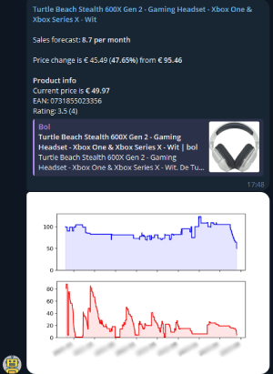

# Bol.com Price Scraper

This project is a high-throughput asynchronous scraper for collecting price data from Bol.com product pages. Built in TypeScript, it utilizes concurrent requests (`got`, `modern-async`) with custom proxy rotation, PostgreSQL persistence (via Sequelize), HTML parsing (`node-html-parser`), and integrated alerting through Telegram and Twilio. Python is invoked via `child_process` for visualizing price and stock trends.

## Overview

- Capable of scraping hundreds of thousands of product prices per hour during peak operation.
- Custom proxy pool implementation to mitigate IP bans (now obsolete due to Bol.com countermeasures).
- Telegram and Twilio integration with templated alerts and embedded plots.
- Sequelize schema defines PostgreSQL structure for historical tracking.
- Python component handles data visualization for price/stock time series.

## Alert Example

## Status

This repository is no longer functional. Bol.com has implemented countermeasures that render proxy-based scraping infeasible using _this_ setup. This code is preserved as a portfolio artifact only.

## Disclaimer

This project used unofficial scraping techniques without Bol.com's permission. It is not maintained, not intended for reuse, and provided solely to demonstrate engineering capability. Do not use it for scraping or any production purpose.

## Notes

- All alerting rules and domain logic reflect personal usage patterns and are not intended for general application.
- No configuration or usage documentation will be provided.
- Support, issue tracking, and pull requests are disabled or ignored.
